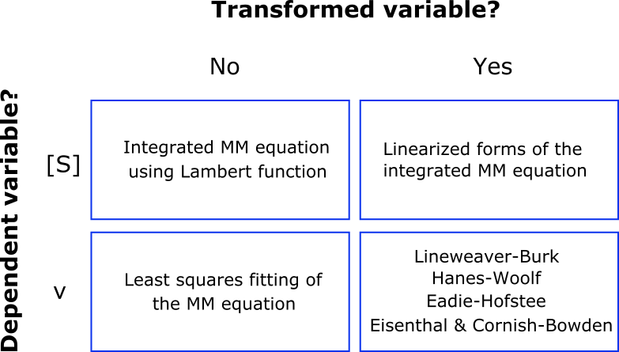
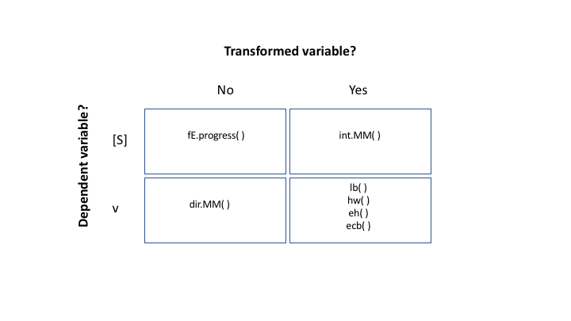

```{r, include = FALSE}
knitr::opts_chunk$set(
  collapse = TRUE,
  comment = "#>"
)
```

```{r setup}
library(renz)
```

## Introduction

We are living in the the Big Data era, and yet we may have serious troubles when dealing with a handful of kinetic data if we are not properly instructed. The aim of this set of vignettes related to enzyme kinetics is to illustrate how to determine the $K_m$ and $V_{max}$ of a michaelian enzyme avoiding the pitfalls in which we often fall. To this end, we will resort to the package *renz*, a useful tool for the study of enzyme kinetics. 

An enzyme is said to be michaelian if the initial velocity of the catalyzed reaction obey the Michaelis-Menten equation:

\begin{equation}
\tag{1}
v = V_{max} \frac{[S]}{K_m + [S]}
\end{equation}

Let's imaging we have obtained the following data for an enzyme we are interested in. 

```{r echo = FALSE}
library(knitr)

Km <- 6
Vm <- 90
S = c(0.5, 1, 2, 4, 7, 10, 13, 20)
v <- round(Vm * S / (Km + S), 2)
data <- data.frame(S,v)
names(data) <- c('[S] (mM)', 'v (au)')
kable(data)

```

We want to determine de kinetic parameters of this enzyme. That is, its $K_m$ and $V_{max}$. One first approach, without a doubt the worst of all the possible approaches, could be plot the data and try to estimate the parameters graphically according to their **operational definitions**:

----------------------------------------------------
* $V_{max}$: the maximal velocity we can get when all the enzymes molecules are saturated with substrate.

* $K_m$: is the substrate concentration that provides half the maximal velocity. 
----------------------------------------------------

Let's try:

```{r, fig.align='center',out.extra='angle=90', echo=FALSE}
plot(S, v, ty = 'b', ylim = c(0, Vm + 0.25*Vm), 
     ylab = 'v (au)', xlab = '[S] (mM)')
abline(h = 74, lty = 2, col = 'blue')
abline(v = (32*Km)/(Vm - 32), lty = 2, col = 'blue')
abline(h = Vm, lty = 2, col = 'red')
abline(v = Km, lty = 2, col = 'red')
```


Because of the hyperbolic relationship between $v$ and $[S]$, any attempt to obtain $K_m$ and $V_{max}$ from a plot of $v$ *vs* $[S]$ would leads us to an unacceptably gross estimation of the sought parameters. I won't ask you to take my word for it. Instead, I will ask you to pronounce on which of the two options given above (the blue and red ones) do you think corresponds to the right kinetic parameters of the enzyme that has generated the represented data?

If you decided on the blue option, I'm sorry to say that you're wrong! It's the horizontal discontinuous red line that corresponds to the $V_{max}$, while the vertical discontinuous red line gives us the right $K_m$. 

So, yes, we better ruled out this first and unsatisfactory approach, but don't worry, we have plenty of methods developed along more than one century of enzymology research. Each of these methods has its own pros and cons, which should be known to avoid serious biases while economizing the time and effort in the laboratory.

Throughout this collection of tutorials we'll discuss the advantages and disadvantages of many of these methods, as well as we'll provide details of how to use them to get reliable kinetic parameters. But for the moment, in the current vignette, we'll limit ourselves to presenting them.



As it can be observed in the table above, we have clustered the methods in four categories. This contingency table is constructed using two binary criteria: (i) which is the dependent variable? and (ii) whether is necessary or not to transform the original variables.

Regarding the first of these criteria, when the method uses the substrate concentration as dependent variable as function of the time, a single progress curve is enough to determine the kinetic parameters. That is, the data consist of a set of (t, [S]) points. On the contrary, when the method uses the initial velocity (dependent variable) as function of the substrate concentration, several progress curves will be required. Indeed, since each velocity is  estimated from a progress curve, we will need as many progress curves as ([S], v) points we want to use in order to determine $K_m$ and $V_{max}$.  Therefore, in absence of any other consideration, the first group of methods (focused on the evolution of [S] with the time) is preferable when compared to the second one, which focus on the effect of [S] on the velocity. 

With respect to the second of the criteria, those methods that do not transform the original variables are preferable because the variable that will have associated experimental error (the dependent variable) when transformed, may distort these errors leading to possible bias in the estimates of $K_m$ and $V_{max}$.

The package **renz** offers functions to estimated the enzyme kinetic parameters using any of the four approaches depicted in the contingency table below:



Individual vignettes for each of these methods can be found at:

* Michaelis-Menten and the Lambert W function.
* Linearization of the integrated Michaelis-Menten equation.
* Fitting the Michaelis-Menten Model. 
* Linearized Michaelis-Menten Equations.


